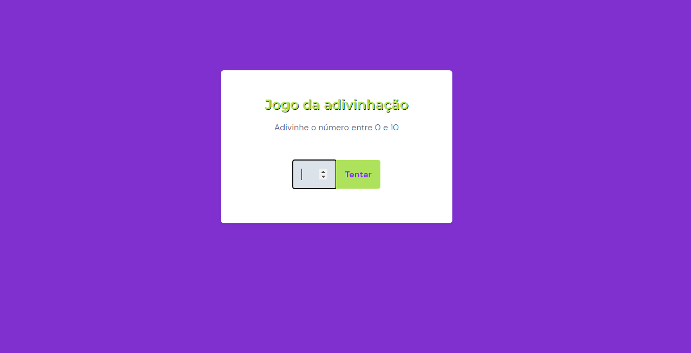

# Jogo da adivinhação 

> Trilha Explorer

Jogo da adivinhação construído no stage 5 (Avançando no JavaScript) trilha Explorer da Rocketseat.

Nesse projeto eu aprendi sobre DOM e seus eventos, aprendi a manipular elementos com DOM, receber e modificar valores, alterar estilos, capturar valores dos inputs, adicionar eventos em botões com o addEventListener(), interromper o padrão de um elemento com o preventDefault(), funções callback e muito mais! 

Com essas aulas que eu tive de JavaScript eu consegui bolar sozinho o dark mode pra essa aplicação, alterando as classes dos itens com classList.toggle(). Estou feliz demais por ter conseguido me desafiar.

[🔗 Clique aqui para acessar](https://filipesantos07.github.io/Jogo-adivinhacao-Stage-5-Rocketseat/)

## 🛠️ Tecnologias

- HTML
- CSS
- JavaScript

## 💛 Contato

FilipeSantosEstudos1@gmail.com
